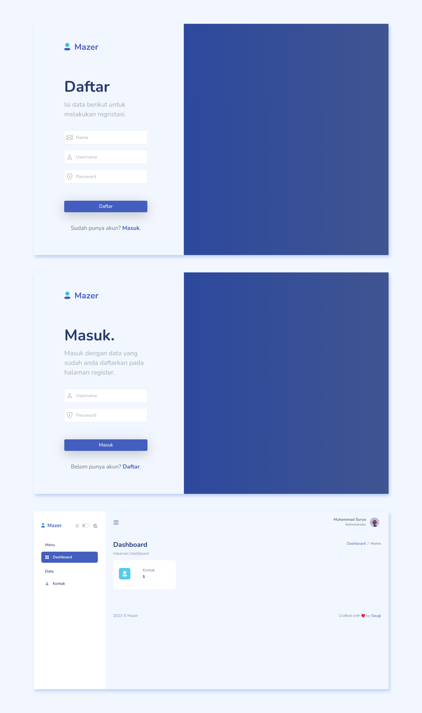

<div align="center" id="top">
  
</div>

<h1 align="center">Farizal Petshop</h1>

<p align="center">
  
  
  
  
</p>

<p align="center">
  <a href="#dart-about">About</a> &#xa0; | &#xa0;
  <a href="#rocket-technologies">Technologies</a> &#xa0; | &#xa0;
  <a href="#white_check_mark-requirements">Requirements</a> &#xa0; | &#xa0;
  <a href="#checkered_flag-setup">Setup</a> &#xa0; | &#xa0;
  <a href="#memo-license">License</a>
</p>

<br>

## :dart: About

Farizal Petshop adalah aplikasi web CRUD (Create, Read, Update, Delete) berbasis PHP Native untuk mengelola petshop. Aplikasi ini mencakup fitur manajemen pengguna, kategori produk, produk, penjualan, dan laporan.

## :rocket: Technologies

Teknologi dan Tools yang digunakan:

- [PHP](https://www.php.net/) >= 8.0
- [MySQL](https://www.mysql.com/) >= 5.7
- [XAMPP](https://www.apachefriends.org/) (untuk development)
- [Visual Studio Code](https://code.visualstudio.com/)
- [Bootstrap](https://getbootstrap.com/) 5
- [SweetAlert2](https://sweetalert2.github.io/)
- [Simple Datatable](https://github.com/fiduswriter/Simple-DataTables)
- [Mazer Dashboard](https://zuramai.github.io/mazer/)

## :white_check_mark: Requirements

Sebelum memulai, pastikan Anda memiliki:

- [XAMPP](https://www.apachefriends.org/) atau server web dengan PHP dan MySQL
- [Git](https://git-scm.com/) (opsional, untuk cloning repository)
- Text editor seperti [Visual Studio Code](https://code.visualstudio.com/)

## :checkered_flag: Setup

Ikuti langkah-langkah berikut untuk menjalankan aplikasi di komputer Anda:

### 1. Clone atau Download Repository

```bash
git clone https://github.com/FarizFx/FarizalPetshop.git
cd FarizalPetshop
```

Atau download ZIP dan ekstrak ke folder htdocs/XAMPP Anda.

### 2. Konfigurasi Database

- Buka phpMyAdmin (biasanya di http://localhost/phpmyadmin)
- Buat database baru dengan nama `farizalpetshop_db`
- Import file SQL `database/database.sql` dari folder `database/`

### 3. Konfigurasi Aplikasi

- Salin file `config.php` dan sesuaikan pengaturan database jika diperlukan:

```php
$hostname = 'localhost';  // Ganti jika berbeda
$username = 'root';       // Username database Anda
$password = '';           // Password database Anda
$database = 'login_petshop'; // Nama database
```

Atau gunakan environment variables untuk keamanan yang lebih baik.

### 4. Jalankan Aplikasi

- Pastikan Apache dan MySQL di XAMPP sudah berjalan
- Akses aplikasi di browser: `http://localhost/farizalpetshop/`
- Login dengan akun default (username: admin, password: admin) atau daftar akun baru

### 5. Struktur Folder

```
farizalpetshop/
├── assets/           # CSS, JS, images
├── database/         # File SQL database
├── function/         # Helper functions
├── layout/           # Template layouts
├── page/             # Halaman aplikasi
├── screenshot/       # Screenshots
├── config.php        # Konfigurasi database
├── index.php         # Entry point
└── README.md         # Dokumentasi ini
```

## :memo: License

This project is under license from MIT. For more details, see the [LICENSE](LICENSE) file.

&#xa0;
